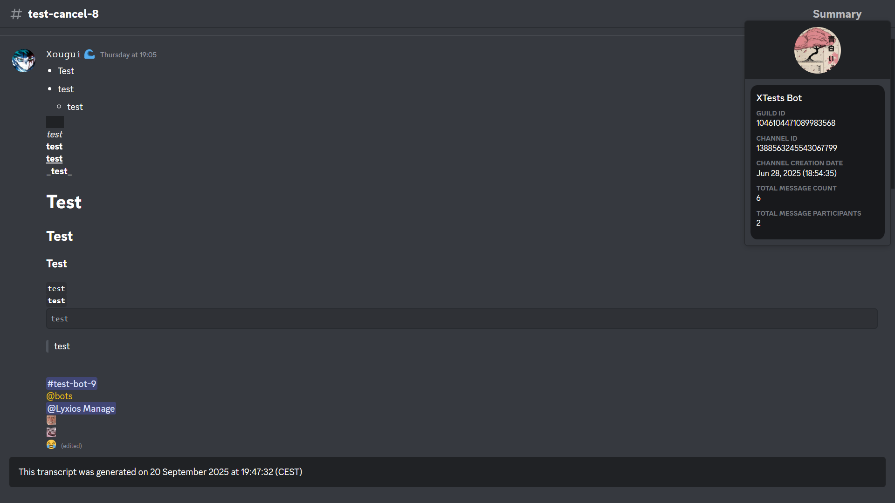

# Discord Channel To HTML Transcripts

<div align="center">
    <p>
        <a href="https://pypi.org/project/DiscordTranscript/">
            
        </a>
        <a href="https://github.com/Xougui/DiscordTranscript/">
            
        </a>
        <a href="https://github.com/Xougui/DiscordTranscript/">
            
        </a>
        <a href="https://github.com/Xougui/DiscordTranscript/">
            
        </a>
        <a href="https://pypi.org/project/DiscordTranscript/">
            
        </a>
        <a href="https://pypi.org/search/?q=&o=&c=Programming+Language+%3A%3A+Python+%3A%3A+3.6&c=Programming+Language+%3A%3A+Python+%3A%3A+3.7&c=Programming+Language+%3A%3A+Python+%3A%3A+3.8&c=Programming+Language+%3A%3A+Python+%3A%3A+3.9&c=Programming+Language+%3A%3A+Python+%3A%3A+3.10&c=Programming+Language+%3A%3A+Python+%3A%3A+3.11&c=Programming+Language+%3A%3A+Python+%3A%3A+3.12&c=Programming+Language+%3A%3A+Python+%3A%3A+3.13">
            
        </a>
    </p>
</div>

A Python library for creating HTML transcripts of Discord channels.

*The base code comes from [py-discord-html-transcripts](https://github.com/FroostySnoowman/py-discord-html-transcripts) and has been adapted and improved.*

---

## Preview




---

## 🇫🇷 Documentation en Français


<details>
<summary>🇫🇷 Documentation en Français</summary>

## Table des matières

- [Prérequis](#prérequis)
- [Installation](#installation)
- [Utilisation](#utilisation)
  - [Utilisation de base](#utilisation-de-base)
  - [Utilisation personnalisable](#utilisation-personnalisable)
  - [Utilisation brute (raw)](#utilisation-brute-raw)
- [Exemples avancés](#exemples-avancés)
  - [Sauvegarder les pièces jointes localement](#sauvegarder-les-pièces-jointes-localement)
  - [Exporter un intervalle de dates spécifique](#exporter-un-intervalle-de-dates-spécifique)
  - [Utilisation dans un Cog](#utilisation-dans-un-cog)
  - [Utilisation avec les commandes d'application](#utilisation-avec-les-commandes-dapplication)
  - [Gestion des erreurs](#gestion-des-erreurs)
- [Plus d'exemples](#plus-dexemples)
  - [Exporter avec le format 12 heures](#exporter-avec-le-format-12-heures)
  - [Exporter avec des horodatages simples](#exporter-avec-des-horodatages-simples)
  - [Exporter une plage de dates combinée](#exporter-une-plage-de-dates-combinée)
  - [Envoyer la transcription dans un autre salon](#envoyer-la-transcription-dans-un-autre-salon)
  - [Envoyer la transcription en message privé](#envoyer-la-transcription-en-message-privé)
  - [Exporter les messages d'un utilisateur spécifique](#exporter-les-messages-dun-utilisateur-spécifique)
  - [Sauvegarde quotidienne automatisée](#sauvegarde-quotidienne-automatisée)
  - [Utilisation avec des boutons d'interface utilisateur](#utilisation-avec-des-boutons-dinterface-utilisateur)

---

## <a id="prérequis"></a>Prérequis

- `discord.py` v2.4.0 ou plus récent

---

## <a id="installation"></a>Installation

Pour installer la librairie, exécutez la commande suivante :

```sh
pip install DiscordTranscript
```

**NOTE :** Cette librairie est une extension pour `discord.py` et ne fonctionne pas de manière autonome. Vous devez avoir un bot `discord.py` fonctionnel pour l'utiliser.

---

## <a id="utilisation"></a>Utilisation

Il existe trois méthodes principales pour exporter une conversation : `quick_export`, `export`, et `raw_export`.

### <a id="utilisation-de-base"></a>Utilisation de base

La fonction `.quick_export()` est la manière la plus simple d'utiliser la librairie. Elle récupère l'historique du salon, génère la transcription, puis la publie directement dans le même salon.

**Arguments requis :**
- `channel`: L'objet `discord.TextChannel` à exporter.

**Arguments optionnels :**
- `bot`: L'objet `commands.Bot` pour récupérer les informations sur les membres qui ne sont plus sur le serveur.

**Retourne :**
- `discord.Message`: Le message contenant la transcription.

<details>
<summary>Exemple</summary>

```python
import discord
import DiscordTranscript
from discord.ext import commands

intents = discord.Intents.default()
intents.members = True
intents.message_content = True

bot = commands.Bot(command_prefix="!", intents=intents)

@bot.command()
async def save(ctx: commands.Context):
    await DiscordTranscript.quick_export(ctx.channel, bot=bot)

bot.run("VOTRE_TOKEN")
```
</details>

### <a id="utilisation-personnalisable"></a>Utilisation personnalisable

La fonction `.export()` est la méthode la plus flexible. Elle permet de personnaliser la transcription avec plusieurs options.

**Arguments requis :**
- `channel`: L'objet `discord.TextChannel` à exporter.

**Arguments optionnels :**
- `limit`: Le nombre maximum de messages à récupérer (par défaut : illimité).
- `tz_info`: Le fuseau horaire à utiliser (ex: "Europe/Paris"). [Liste des fuseaux horaires](https://en.wikipedia.org/wiki/List_of_tz_database_time_zones#List).
- `military_time`: `True` pour utiliser le format 24h, `False` pour le format 12h (par défaut : `True`).
- `fancy_times`: `True` pour afficher des temps relatifs (ex: "Aujourd'hui à..."), `False` sinon (par défaut : `True`).
- `before`: Un objet `datetime.datetime` pour récupérer les messages avant cette date.
- `after`: Un objet `datetime.datetime` pour récupérer les messages après cette date.
- `bot`: L'objet `commands.Bot`.

**Retourne :**
- `str`: Le contenu HTML de la transcription.

<details>
<summary>Exemple</summary>

```python
import io
import discord
import DiscordTranscript
from discord.ext import commands

# ... (initialisation du bot)

@bot.command()
async def save_custom(ctx: commands.Context):
    transcript = await DiscordTranscript.export(
        ctx.channel,
        limit=100,
        tz_info="Europe/Paris",
        military_time=True,
        bot=bot,
    )

    if transcript is None:
        return

    transcript_file = discord.File(
        io.BytesIO(transcript.encode()),
        filename=f"transcript-{ctx.channel.name}.html",
    )

    await ctx.send(file=transcript_file)
```
</details>

### <a id="utilisation-brute-raw"></a>Utilisation brute (raw)

La fonction `.raw_export()` permet de créer une transcription à partir d'une liste de messages que vous fournissez.

**Arguments requis :**
- `channel`: L'objet `discord.TextChannel` (utilisé pour les en-têtes).
- `messages`: Une liste d'objets `discord.Message`.

**Arguments optionnels :**
- `tz_info`, `military_time`, `fancy_times`, `bot`.

**Retourne :**
- `str`: Le contenu HTML de la transcription.

<details>
<summary>Exemple</summary>

```python
import io
import discord
import DiscordTranscript
from discord.ext import commands

# ... (initialisation du bot)

@bot.command()
async def save_purged(ctx: commands.Context):
    deleted_messages = await ctx.channel.purge(limit=50)

    transcript = await DiscordTranscript.raw_export(
        ctx.channel,
        messages=deleted_messages,
        bot=bot,
    )

    if transcript is None:
        return

    transcript_file = discord.File(
        io.BytesIO(transcript.encode()),
        filename=f"purged-transcript-{ctx.channel.name}.html",
    )

    await ctx.send("Voici la transcription des messages supprimés :", file=transcript_file)
```
</details>

---

## <a id="exemples-avancés"></a>Exemples avancés

### <a id="sauvegarder-les-pièces-jointes-localement"></a>Sauvegarder les pièces jointes localement

Par défaut, les pièces jointes sont liées via leur URL Discord. Pour les sauvegarder localement, utilisez `AttachmentToLocalFileHostHandler`.

<details>
<summary>Exemple</summary>

```python
import io
import os
import discord
import DiscordTranscript
from DiscordTranscript.construct.attachment_handler import AttachmentToLocalFileHostHandler
from discord.ext import commands

# ... (initialisation du bot)

@bot.command()
async def save_local_attachments(ctx: commands.Context):
    if not os.path.exists(f"attachments/{ctx.channel.id}"):
        os.makedirs(f"attachments/{ctx.channel.id}")

    transcript = await DiscordTranscript.export(
        ctx.channel,
        attachment_handler=AttachmentToLocalFileHostHandler(
            path=f"attachments/{ctx.channel.id}"
        ),
        bot=bot,
    )

    if transcript is None:
        return

    transcript_file = discord.File(
        io.BytesIO(transcript.encode()),
        filename=f"transcript-{ctx.channel.name}.html",
    )

    await ctx.send(file=transcript_file)
```
</details>

### <a id="exporter-un-intervalle-de-dates-spécifique"></a>Exporter un intervalle de dates spécifique

Utilisez les paramètres `before` et `after` pour exporter une période précise.

<details>
<summary>Exemple</summary>

```python
import io
import discord
import datetime
import DiscordTranscript
from discord.ext import commands

# ... (initialisation du bot)

@bot.command()
async def save_last_week(ctx: commands.Context):
    after_date = datetime.datetime.now() - datetime.timedelta(days=7)

    transcript = await DiscordTranscript.export(
        ctx.channel,
        after=after_date,
        bot=bot,
    )

    if transcript is None:
        return

    transcript_file = discord.File(
        io.BytesIO(transcript.encode()),
        filename=f"transcript-last-week-{ctx.channel.name}.html",
    )

    await ctx.send(file=transcript_file)
```
</details>

### <a id="utilisation-dans-un-cog"></a>Utilisation dans un Cog

Organisez votre code en utilisant des Cogs.

<details>
<summary>Exemple</summary>

```python
# cogs/transcript_cog.py
import io
import discord
import DiscordTranscript
from discord.ext import commands

class TranscriptCog(commands.Cog):
    def __init__(self, bot: commands.Bot):
        self.bot = bot

    @commands.command()
    async def save_in_cog(self, ctx: commands.Context):
        transcript = await DiscordTranscript.export(
            ctx.channel,
            bot=self.bot,
        )

        if transcript is None:
            return

        transcript_file = discord.File(
            io.BytesIO(transcript.encode()),
            filename=f"transcript-{ctx.channel.name}.html",
        )

        await ctx.send(file=transcript_file)

async def setup(bot: commands.Bot):
    await bot.add_cog(TranscriptCog(bot))
```
</details>

### <a id="utilisation-avec-les-commandes-dapplication"></a>Utilisation avec les commandes d'application

Utilisez `DiscordTranscript` avec les commandes slash.

<details>
<summary>Exemple</summary>

```python
import io
import discord
import DiscordTranscript
from discord import app_commands

# ... (initialisation du bot)

@bot.tree.command(name="save", description="Sauvegarde la conversation actuelle.")
@app_commands.describe(channel="Le salon à sauvegarder (optionnel, défaut: salon actuel)")
async def save_slash(interaction: discord.Interaction, channel: discord.TextChannel = None):
    await interaction.response.defer()
    
    if channel is None:
        channel = interaction.channel

    transcript = await DiscordTranscript.export(
        channel,
        bot=bot,
    )

    if transcript is None:
        await interaction.followup.send("Impossible de sauvegarder la conversation.", ephemeral=True)
        return

    transcript_file = discord.File(
        io.BytesIO(transcript.encode()),
        filename=f"transcript-{channel.name}.html",
    )

    await interaction.followup.send(file=transcript_file)

# N'oubliez pas de synchroniser l'arbre de commandes
# @bot.event
# async def on_ready():
#     await bot.tree.sync()
```
</details>

### <a id="gestion-des-erreurs"></a>Gestion des erreurs

Il est important de gérer les erreurs potentielles, comme les permissions manquantes.

<details>
<summary>Exemple</summary>

```python
import io
import discord
import DiscordTranscript
from discord.ext import commands

# ... (initialisation du bot)

@bot.command()
async def save_safe(ctx: commands.Context):
    try:
        transcript = await DiscordTranscript.export(
            ctx.channel,
            bot=bot,
        )
    except discord.Forbidden:
        await ctx.send("Je n'ai pas la permission de lire l'historique de ce salon.")
        return
    except Exception as e:
        await ctx.send(f"Une erreur est survenue : {e}")
        return

    if transcript is None:
        return

    transcript_file = discord.File(
        io.BytesIO(transcript.encode()),
        filename=f"transcript-{ctx.channel.name}.html",
    )

    await ctx.send(file=transcript_file)
```
</details>

</details>

---

## <a id="plus-dexemples"></a>Plus d'exemples

Voici d'autres exemples pour vous aider à démarrer.

### <a id="exporter-avec-le-format-12-heures"></a>Exporter avec le format 12 heures

Utilisez `military_time=False` pour afficher les heures au format AM/PM.

<details>
<summary>Exemple</summary>

```python
import io
import discord
import DiscordTranscript
from discord.ext import commands

# ... (initialisation du bot)

@bot.command()
async def save_12h(ctx: commands.Context):
    transcript = await DiscordTranscript.export(
        ctx.channel,
        military_time=False,
        bot=bot,
    )

    if transcript is None:
        return

    transcript_file = discord.File(
        io.BytesIO(transcript.encode()),
        filename=f"transcript-{ctx.channel.name}.html",
    )

    await ctx.send(file=transcript_file)
```
</details>

### <a id="exporter-avec-des-horodatages-simples"></a>Exporter avec des horodatages simples

Utilisez `fancy_times=False` pour désactiver les horodatages relatifs (par exemple, "Aujourd'hui à...") et afficher les dates complètes.

<details>
<summary>Exemple</summary>

```python
import io
import discord
import DiscordTranscript
from discord.ext import commands

# ... (initialisation du bot)

@bot.command()
async def save_simple_times(ctx: commands.Context):
    transcript = await DiscordTranscript.export(
        ctx.channel,
        fancy_times=False,
        bot=bot,
    )

    if transcript is None:
        return

    transcript_file = discord.File(
        io.BytesIO(transcript.encode()),
        filename=f"transcript-{ctx.channel.name}.html",
    )

    await ctx.send(file=transcript_file)
```
</details>

### <a id="exporter-une-plage-de-dates-combinée"></a>Exporter une plage de dates combinée

Combinez `before` et `after` pour exporter une période très spécifique, par exemple, uniquement les messages d'hier.

<details>
<summary>Exemple</summary>

```python
import io
import discord
import datetime
import DiscordTranscript
from discord.ext import commands

# ... (initialisation du bot)

@bot.command()
async def save_yesterday(ctx: commands.Context):
    today = datetime.datetime.now().replace(hour=0, minute=0, second=0, microsecond=0)
    yesterday = today - datetime.timedelta(days=1)

    transcript = await DiscordTranscript.export(
        ctx.channel,
        before=today,
        after=yesterday,
        bot=bot,
    )

    if transcript is None:
        return

    transcript_file = discord.File(
        io.BytesIO(transcript.encode()),
        filename=f"transcript-yesterday-{ctx.channel.name}.html",
    )

    await ctx.send(file=transcript_file)
```
</details>

### <a id="envoyer-la-transcription-dans-un-autre-salon"></a>Envoyer la transcription dans un autre salon

Vous pouvez envoyer la transcription dans un salon différent de celui où la commande a été exécutée.

<details>
<summary>Exemple</summary>

```python
import io
import discord
import DiscordTranscript
from discord.ext import commands

# ... (initialisation du bot)

LOG_CHANNEL_ID = 123456789012345678 # Remplacez par l'ID de votre salon de logs

@bot.command()
async def save_to_log(ctx: commands.Context):
    log_channel = bot.get_channel(LOG_CHANNEL_ID)
    if not log_channel:
        await ctx.send("Le salon de logs n'a pas été trouvé.")
        return

    transcript = await DiscordTranscript.export(
        ctx.channel,
        bot=bot,
    )

    if transcript is None:
        return

    transcript_file = discord.File(
        io.BytesIO(transcript.encode()),
        filename=f"transcript-{ctx.channel.name}.html",
    )

    await log_channel.send(f"Transcription du salon {ctx.channel.mention}", file=transcript_file)
    await ctx.send("Transcription envoyée dans le salon de logs.")
```
</details>

### <a id="envoyer-la-transcription-en-message-privé"></a>Envoyer la transcription en message privé

Vous pouvez également envoyer la transcription directement à l'utilisateur en message privé.

<details>
<summary>Exemple</summary>

```python
import io
import discord
import DiscordTranscript
from discord.ext import commands

# ... (initialisation du bot)

@bot.command()
async def save_dm(ctx: commands.Context):
    transcript = await DiscordTranscript.export(
        ctx.channel,
        bot=bot,
    )

    if transcript is None:
        return

    transcript_file = discord.File(
        io.BytesIO(transcript.encode()),
        filename=f"transcript-{ctx.channel.name}.html",
    )

    try:
        await ctx.author.send(f"Voici la transcription du salon {ctx.channel.mention}", file=transcript_file)
        await ctx.send("Je vous ai envoyé la transcription en message privé.")
    except discord.Forbidden:
        await ctx.send("Je ne peux pas vous envoyer de message privé. Veuillez activer vos MPs.")
```
</details>

### <a id="exporter-les-messages-dun-utilisateur-spécifique"></a>Exporter les messages d'un utilisateur spécifique

Utilisez `raw_export` pour n'exporter que les messages d'un utilisateur donné dans un salon.

<details>
<summary>Exemple</summary>

```python
import io
import discord
import DiscordTranscript
from discord.ext import commands

# ... (initialisation du bot)

@bot.command()
async def save_user(ctx: commands.Context, member: discord.Member):
    messages = [message async for message in ctx.channel.history(limit=None) if message.author == member]

    if not messages:
        await ctx.send(f"Aucun message de {member.mention} n'a été trouvé dans ce salon.")
        return

    transcript = await DiscordTranscript.raw_export(
        ctx.channel,
        messages=messages,
        bot=bot,
    )

    if transcript is None:
        return

    transcript_file = discord.File(
        io.BytesIO(transcript.encode()),
        filename=f"transcript-{ctx.channel.name}-{member.name}.html",
    )

    await ctx.send(f"Voici la transcription des messages de {member.mention}", file=transcript_file)
```
</details>

### <a id="sauvegarde-quotidienne-automatisée"></a>Sauvegarde quotidienne automatisée

Utilisez `discord.ext.tasks` pour créer automatiquement une sauvegarde d'un salon chaque jour.

<details>
<summary>Exemple</summary>

```python
import io
import discord
import datetime
import DiscordTranscript
from discord.ext import commands, tasks

# ... (initialisation du bot)

BACKUP_CHANNEL_ID = 123456789012345678 # Le salon à sauvegarder
LOG_CHANNEL_ID = 123456789012345679 # Le salon où envoyer la sauvegarde

@tasks.loop(time=datetime.time(hour=0, minute=0)) # S'exécute tous les jours à minuit
async def daily_backup():
    backup_channel = bot.get_channel(BACKUP_CHANNEL_ID)
    log_channel = bot.get_channel(LOG_CHANNEL_ID)

    if not backup_channel or not log_channel:
        print("Les salons de sauvegarde ou de logs n'ont pas été trouvés.")
        return

    transcript = await DiscordTranscript.export(
        backup_channel,
        bot=bot,
    )

    if transcript is None:
        return

    transcript_file = discord.File(
        io.BytesIO(transcript.encode()),
        filename=f"backup-{datetime.date.today()}.html",
    )

    await log_channel.send(f"Sauvegarde du {datetime.date.today()}", file=transcript_file)

@bot.event
async def on_ready():
    print(f"{bot.user} est en ligne !")
    daily_backup.start()

```
</details>

### <a id="utilisation-avec-des-boutons-dinterface-utilisateur"></a>Utilisation avec des boutons d'interface utilisateur

Utilisez les vues (`discord.ui.View`) pour créer des interfaces interactives, comme un bouton pour demander une transcription.

<details>
<summary>Exemple</summary>

```python
import io
import discord
import DiscordTranscript
from discord.ext import commands
from discord import ui

# ... (initialisation du bot)

class TranscriptView(ui.View):
    def __init__(self, channel: discord.TextChannel, bot: commands.Bot):
        super().__init__(timeout=None)
        self.channel = channel
        self.bot = bot

    @ui.button(label="Créer une transcription", style=discord.ButtonStyle.primary, emoji="📄")
    async def create_transcript(self, interaction: discord.Interaction, button: ui.Button):
        await interaction.response.defer(thinking=True, ephemeral=True)

        transcript = await DiscordTranscript.export(
            self.channel,
            bot=self.bot,
        )

        if transcript is None:
            await interaction.followup.send("Impossible de créer la transcription.", ephemeral=True)
            return

        transcript_file = discord.File(
            io.BytesIO(transcript.encode()),
            filename=f"transcript-{self.channel.name}.html",
        )

        await interaction.followup.send(file=transcript_file, ephemeral=True)

@bot.command()
async def ticket(ctx: commands.Context):
    view = TranscriptView(ctx.channel, bot)
    await ctx.send("Cliquez sur le bouton ci-dessous pour créer une transcription de ce salon.", view=view)

```
</details>

---

## 🇬🇧 English Documentation


<details>
<summary>🇬🇧 English Documentation</summary>

## Table of Contents

- [Prerequisites](#prerequisites-en)
- [Installation](#installation-en)
- [Usage](#usage-en)
  - [Basic Usage](#basic-usage-en)
  - [Customizable Usage](#customizable-usage-en)
  - [Raw Usage](#raw-usage-en)
- [Advanced Examples](#advanced-examples-en)
  - [Saving Attachments Locally](#saving-attachments-locally-en)
  - [Exporting a Specific Date Range](#exporting-a-specific-date-range-en)
  - [Usage in a Cog](#usage-in-a-cog-en)
  - [Usage with Application Commands](#usage-with-application-commands-en)
  - [Error Handling](#error-handling-en)
- [More Examples](#more-examples-en)
  - [Exporting with 12-hour format](#exporting-with-12-hour-format-en)
  - [Exporting with simple timestamps](#exporting-with-simple-timestamps-en)
  - [Exporting a combined date range](#exporting-a-combined-date-range-en)
  - [Sending the transcript to another channel](#sending-the-transcript-to-another-channel-en)
  - [DMing the transcript to the user](#dming-the-transcript-to-the-user-en)
  - [Exporting messages from a specific user](#exporting-messages-from-a-specific-user-en)
  - [Automated daily backup](#automated-daily-backup-en)
  - [Usage with UI Buttons](#usage-with-ui-buttons-en)

---

## <a id="prerequisites-en"></a>Prerequisites

- `discord.py` v2.4.0 or newer

---

## <a id="installation-en"></a>Installation

To install the library, run the following command:

```sh
pip install DiscordTranscript
```

**NOTE:** This library is an extension for `discord.py` and does not work standalone. You must have a functional `discord.py` bot to use it.

---

## <a id="usage-en"></a>Usage

There are three main methods for exporting a conversation: `quick_export`, `export`, and `raw_export`.

### <a id="basic-usage-en"></a>Basic Usage

The `.quick_export()` function is the simplest way to use the library. It retrieves the channel's history, generates the transcript, and then publishes it directly in the same channel.

**Required Arguments:**
- `channel`: The `discord.TextChannel` object to export.

**Optional Arguments:**
- `bot`: The `commands.Bot` object to retrieve information about members who are no longer on the server.

**Returns:**
- `discord.Message`: The message containing the transcript.

<details>
<summary>Example</summary>

```python
import discord
import DiscordTranscript
from discord.ext import commands

intents = discord.Intents.default()
intents.members = True
intents.message_content = True

bot = commands.Bot(command_prefix="!", intents=intents)

@bot.command()
async def save(ctx: commands.Context):
    await DiscordTranscript.quick_export(ctx.channel, bot=bot)

bot.run("YOUR_TOKEN")
```
</details>

### <a id="customizable-usage-en"></a>Customizable Usage

The `.export()` function is the most flexible method. It allows you to customize the transcript with several options.

**Required Arguments:**
- `channel`: The `discord.TextChannel` object to export.

**Optional Arguments:**
- `limit`: The maximum number of messages to retrieve (default: unlimited).
- `tz_info`: The timezone to use (e.g., "America/New_York"). [List of timezones](https://en.wikipedia.org/wiki/List_of_tz_database_time_zones#List).
- `military_time`: `True` to use 24h format, `False` for 12h format (default: `True`).
- `fancy_times`: `True` to display relative times (e.g., "Today at..."), `False` otherwise (default: `True`).
- `before`: A `datetime.datetime` object to retrieve messages before this date.
- `after`: A `datetime.datetime` object to retrieve messages after this date.
- `bot`: The `commands.Bot` object.

**Returns:**
- `str`: The HTML content of the transcript.

<details>
<summary>Example</summary>

```python
import io
import discord
import DiscordTranscript
from discord.ext import commands

# ... (bot initialization)

@bot.command()
async def save_custom(ctx: commands.Context):
    transcript = await DiscordTranscript.export(
        ctx.channel,
        limit=100,
        tz_info="America/New_York",
        military_time=True,
        bot=bot,
    )

    if transcript is None:
        return

    transcript_file = discord.File(
        io.BytesIO(transcript.encode()),
        filename=f"transcript-{ctx.channel.name}.html",
    )

    await ctx.send(file=transcript_file)
```
</details>

### <a id="raw-usage-en"></a>Raw Usage

The `.raw_export()` function allows you to create a transcript from a list of messages you provide.

**Required Arguments:**
- `channel`: The `discord.TextChannel` object (used for headers).
- `messages`: A list of `discord.Message` objects.

**Optional Arguments:**
- `tz_info`, `military_time`, `fancy_times`, `bot`.

**Returns:**
- `str`: The HTML content of the transcript.

<details>
<summary>Example</summary>

```python
import io
import discord
import DiscordTranscript
from discord.ext import commands

# ... (bot initialization)

@bot.command()
async def save_purged(ctx: commands.Context):
    deleted_messages = await ctx.channel.purge(limit=50)

    transcript = await DiscordTranscript.raw_export(
        ctx.channel,
        messages=deleted_messages,
        bot=bot,
    )

    if transcript is None:
        return

    transcript_file = discord.File(
        io.BytesIO(transcript.encode()),
        filename=f"purged-transcript-{ctx.channel.name}.html",
    )

    await ctx.send("Here is the transcript of the deleted messages:", file=transcript_file)
```
</details>

---

## <a id="advanced-examples-en"></a>Advanced Examples

### <a id="saving-attachments-locally-en"></a>Saving Attachments Locally

By default, attachments are linked via their Discord URL. To save them locally, use `AttachmentToLocalFileHostHandler`.

<details>
<summary>Example</summary>

```python
import io
import os
import discord
import DiscordTranscript
from DiscordTranscript.construct.attachment_handler import AttachmentToLocalFileHostHandler
from discord.ext import commands

# ... (bot initialization)

@bot.command()
async def save_local_attachments(ctx: commands.Context):
    if not os.path.exists(f"attachments/{ctx.channel.id}"):
        os.makedirs(f"attachments/{ctx.channel.id}")

    transcript = await DiscordTranscript.export(
        ctx.channel,
        attachment_handler=AttachmentToLocalFileHostHandler(
            path=f"attachments/{ctx.channel.id}"
        ),
        bot=bot,
    )

    if transcript is None:
        return

    transcript_file = discord.File(
        io.BytesIO(transcript.encode()),
        filename=f"transcript-{ctx.channel.name}.html",
    )

    await ctx.send(file=transcript_file)
```
</details>

### <a id="exporting-a-specific-date-range-en"></a>Exporting a Specific Date Range

Use the `before` and `after` parameters to export a specific period.

<details>
<summary>Example</summary>

```python
import io
import discord
import datetime
import DiscordTranscript
from discord.ext import commands

# ... (bot initialization)

@bot.command()
async def save_last_week(ctx: commands.Context):
    after_date = datetime.datetime.now() - datetime.timedelta(days=7)

    transcript = await DiscordTranscript.export(
        ctx.channel,
        after=after_date,
        bot=bot,
    )

    if transcript is None:
        return

    transcript_file = discord.File(
        io.BytesIO(transcript.encode()),
        filename=f"transcript-last-week-{ctx.channel.name}.html",
    )

    await ctx.send(file=transcript_file)
```
</details>

### <a id="usage-in-a-cog-en"></a>Usage in a Cog

Organize your code using Cogs.

<details>
<summary>Example</summary>

```python
# cogs/transcript_cog.py
import io
import discord
import DiscordTranscript
from discord.ext import commands

class TranscriptCog(commands.Cog):
    def __init__(self, bot: commands.Bot):
        self.bot = bot

    @commands.command()
    async def save_in_cog(self, ctx: commands.Context):
        transcript = await DiscordTranscript.export(
            ctx.channel,
            bot=self.bot,
        )

        if transcript is None:
            return

        transcript_file = discord.File(
            io.BytesIO(transcript.encode()),
            filename=f"transcript-{ctx.channel.name}.html",
        )

        await ctx.send(file=transcript_file)

async def setup(bot: commands.Bot):
    await bot.add_cog(TranscriptCog(bot))
```
</details>

### <a id="usage-with-application-commands-en"></a>Usage with Application Commands

Use `DiscordTranscript` with slash commands.

<details>
<summary>Example</summary>

```python
import io
import discord
import DiscordTranscript
from discord import app_commands

# ... (bot initialization)

@bot.tree.command(name="save", description="Saves the current conversation.")
@app_commands.describe(channel="The channel to save (optional, defaults to current channel)")
async def save_slash(interaction: discord.Interaction, channel: discord.TextChannel = None):
    await interaction.response.defer()

    if channel is None:
        channel = interaction.channel

    transcript = await DiscordTranscript.export(
        channel,
        bot=bot,
    )

    if transcript is None:
        await interaction.followup.send("Could not save the conversation.", ephemeral=True)
        return

    transcript_file = discord.File(
        io.BytesIO(transcript.encode()),
        filename=f"transcript-{channel.name}.html",
    )

    await interaction.followup.send(file=transcript_file)

# Don't forget to sync the command tree
# @bot.event
# async def on_ready():
#     await bot.tree.sync()
```
</details>

### <a id="error-handling-en"></a>Error Handling

It is important to handle potential errors, such as missing permissions.

<details>
<summary>Example</summary>

```python
import io
import discord
import DiscordTranscript
from discord.ext import commands

# ... (bot initialization)

@bot.command()
async def save_safe(ctx: commands.Context):
    try:
        transcript = await DiscordTranscript.export(
            ctx.channel,
            bot=bot,
        )
    except discord.Forbidden:
        await ctx.send("I don't have permission to read the history of this channel.")
        return
    except Exception as e:
        await ctx.send(f"An error occurred: {e}")
        return

    if transcript is None:
        return

    transcript_file = discord.File(
        io.BytesIO(transcript.encode()),
        filename=f"transcript-{ctx.channel.name}.html",
    )

    await ctx.send(file=transcript_file)
```
</details>

</details>

---

## <a id="more-examples-en"></a>More Examples

Here are some more examples to get you started.

### <a id="exporting-with-12-hour-format-en"></a>Exporting with 12-hour format

Use `military_time=False` to display times in AM/PM format.

<details>
<summary>Example</summary>

```python
import io
import discord
import DiscordTranscript
from discord.ext import commands

# ... (bot initialization)

@bot.command()
async def save_12h(ctx: commands.Context):
    transcript = await DiscordTranscript.export(
        ctx.channel,
        military_time=False,
        bot=bot,
    )

    if transcript is None:
        return

    transcript_file = discord.File(
        io.BytesIO(transcript.encode()),
        filename=f"transcript-{ctx.channel.name}.html",
    )

    await ctx.send(file=transcript_file)
```
</details>

### <a id="exporting-with-simple-timestamps-en"></a>Exporting with simple timestamps

Use `fancy_times=False` to disable relative timestamps (e.g., "Today at...") and display full dates instead.

<details>
<summary>Example</summary>

```python
import io
import discord
import DiscordTranscript
from discord.ext import commands

# ... (bot initialization)

@bot.command()
async def save_simple_times(ctx: commands.Context):
    transcript = await DiscordTranscript.export(
        ctx.channel,
        fancy_times=False,
        bot=bot,
    )

    if transcript is None:
        return

    transcript_file = discord.File(
        io.BytesIO(transcript.encode()),
        filename=f"transcript-{ctx.channel.name}.html",
    )

    await ctx.send(file=transcript_file)
```
</details>

### <a id="exporting-a-combined-date-range-en"></a>Exporting a combined date range

Combine `before` and `after` to export a very specific period, for example, only yesterday's messages.

<details>
<summary>Example</summary>

```python
import io
import discord
import datetime
import DiscordTranscript
from discord.ext import commands

# ... (bot initialization)

@bot.command()
async def save_yesterday(ctx: commands.Context):
    today = datetime.datetime.now().replace(hour=0, minute=0, second=0, microsecond=0)
    yesterday = today - datetime.timedelta(days=1)

    transcript = await DiscordTranscript.export(
        ctx.channel,
        before=today,
        after=yesterday,
        bot=bot,
    )

    if transcript is None:
        return

    transcript_file = discord.File(
        io.BytesIO(transcript.encode()),
        filename=f"transcript-yesterday-{ctx.channel.name}.html",
    )

    await ctx.send(file=transcript_file)
```
</details>

### <a id="sending-the-transcript-to-another-channel-en"></a>Sending the transcript to another channel

You can send the transcript to a different channel from where the command was executed.

<details>
<summary>Example</summary>

```python
import io
import discord
import DiscordTranscript
from discord.ext import commands

# ... (bot initialization)

LOG_CHANNEL_ID = 123456789012345678 # Replace with your log channel ID

@bot.command()
async def save_to_log(ctx: commands.Context):
    log_channel = bot.get_channel(LOG_CHANNEL_ID)
    if not log_channel:
        await ctx.send("The log channel was not found.")
        return

    transcript = await DiscordTranscript.export(
        ctx.channel,
        bot=bot,
    )

    if transcript is None:
        return

    transcript_file = discord.File(
        io.BytesIO(transcript.encode()),
        filename=f"transcript-{ctx.channel.name}.html",
    )

    await log_channel.send(f"Transcript from {ctx.channel.mention}", file=transcript_file)
    await ctx.send("Transcript sent to the log channel.")
```
</details>

### <a id="dming-the-transcript-to-the-user-en"></a>DMing the transcript to the user

You can also send the transcript directly to the user in a DM.

<details>
<summary>Example</summary>

```python
import io
import discord
import DiscordTranscript
from discord.ext import commands

# ... (bot initialization)

@bot.command()
async def save_dm(ctx: commands.Context):
    transcript = await DiscordTranscript.export(
        ctx.channel,
        bot=bot,
    )

    if transcript is None:
        return

    transcript_file = discord.File(
        io.BytesIO(transcript.encode()),
        filename=f"transcript-{ctx.channel.name}.html",
    )

    try:
        await ctx.author.send(f"Here is the transcript from {ctx.channel.mention}", file=transcript_file)
        await ctx.send("I have sent you the transcript in a DM.")
    except discord.Forbidden:
        await ctx.send("I could not send you a DM. Please enable your DMs.")
```
</details>

### <a id="exporting-messages-from-a-specific-user-en"></a>Exporting messages from a specific user

Use `raw_export` to export only the messages of a specific user in a channel.

<details>
<summary>Example</summary>

```python
import io
import discord
import DiscordTranscript
from discord.ext import commands

# ... (bot initialization)

@bot.command()
async def save_user(ctx: commands.Context, member: discord.Member):
    messages = [message async for message in ctx.channel.history(limit=None) if message.author == member]

    if not messages:
        await ctx.send(f"No messages from {member.mention} were found in this channel.")
        return

    transcript = await DiscordTranscript.raw_export(
        ctx.channel,
        messages=messages,
        bot=bot,
    )

    if transcript is None:
        return

    transcript_file = discord.File(
        io.BytesIO(transcript.encode()),
        filename=f"transcript-{ctx.channel.name}-{member.name}.html",
    )

    await ctx.send(f"Here is the transcript of messages from {member.mention}", file=transcript_file)
```
</details>

### <a id="automated-daily-backup-en"></a>Automated daily backup

Use `discord.ext.tasks` to automatically create a backup of a channel every day.

<details>
<summary>Example</summary>

```python
import io
import discord
import datetime
import DiscordTranscript
from discord.ext import commands, tasks

# ... (bot initialization)

BACKUP_CHANNEL_ID = 123456789012345678 # The channel to backup
LOG_CHANNEL_ID = 123456789012345679 # The channel to send the backup to

@tasks.loop(time=datetime.time(hour=0, minute=0)) # Runs every day at midnight
async def daily_backup():
    backup_channel = bot.get_channel(BACKUP_CHANNEL_ID)
    log_channel = bot.get_channel(LOG_CHANNEL_ID)

    if not backup_channel or not log_channel:
        print("Backup or log channels not found.")
        return

    transcript = await DiscordTranscript.export(
        backup_channel,
        bot=bot,
    )

    if transcript is None:
        return

    transcript_file = discord.File(
        io.BytesIO(transcript.encode()),
        filename=f"backup-{datetime.date.today()}.html",
    )

    await log_channel.send(f"Backup for {datetime.date.today()}", file=transcript_file)

@bot.event
async def on_ready():
    print(f"{bot.user} is online!")
    daily_backup.start()

```
</details>

### <a id="usage-with-ui-buttons-en"></a>Usage with UI Buttons

Use views (`discord.ui.View`) to create interactive interfaces, such as a button to request a transcript.

<details>
<summary>Example</summary>

```python
import io
import discord
import DiscordTranscript
from discord.ext import commands
from discord import ui

# ... (bot initialization)

class TranscriptView(ui.View):
    def __init__(self, channel: discord.TextChannel, bot: commands.Bot):
        super().__init__(timeout=None)
        self.channel = channel
        self.bot = bot

    @ui.button(label="Create Transcript", style=discord.ButtonStyle.primary, emoji="📄")
    async def create_transcript(self, interaction: discord.Interaction, button: ui.Button):
        await interaction.response.defer(thinking=True, ephemeral=True)

        transcript = await DiscordTranscript.export(
            self.channel,
            bot=self.bot,
        )

        if transcript is None:
            await interaction.followup.send("Could not create the transcript.", ephemeral=True)
            return

        transcript_file = discord.File(
            io.BytesIO(transcript.encode()),
            filename=f"transcript-{self.channel.name}.html",
        )

        await interaction.followup.send(file=transcript_file, ephemeral=True)

@bot.command()
async def ticket(ctx: commands.Context):
    view = TranscriptView(ctx.channel, bot)
    await ctx.send("Click the button below to create a transcript of this channel.", view=view)

```
</details>
