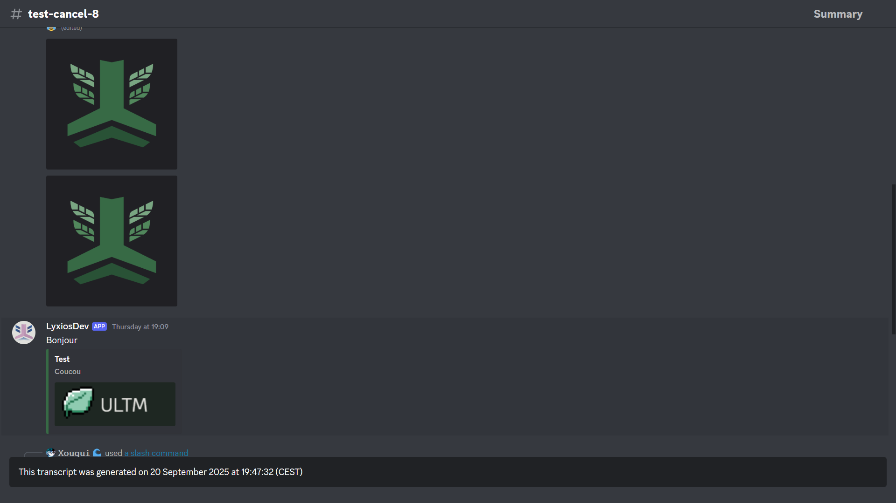

# Discord Channel To HTML Transcripts

<div align="center">
    <p>
        <a href="https://pypi.org/project/DiscordTranscript/">
            
        </a>
        <a href="https://pypi.org/project/DiscordTranscript/">
            
        </a>
    </p>
</div>

<details>
<summary>🇬🇧 English Documentation</summary>

A Python library for creating HTML transcripts of Discord channels.

*The base code comes from [py-discord-html-transcripts](https://github.com/FroostySnoowman/py-discord-html-transcripts) and has been adapted and improved.*

---

## Preview





---

## Table of Contents

- [Prerequisites](#prerequisites-en)
- [Installation](#installation-en)
- [Usage](#usage-en)
  - [Basic Usage](#basic-usage-en)
  - [Customizable Usage](#customizable-usage-en)
  - [Raw Usage](#raw-usage-en)
- [Advanced Examples](#advanced-examples-en)
  - [Saving Attachments Locally](#saving-attachments-locally-en)
  - [Exporting a Specific Date Range](#exporting-a-specific-date-range-en)
  - [Usage in a Cog](#usage-in-a-cog-en)
  - [Usage with Application Commands](#usage-with-application-commands-en)
  - [Error Handling](#error-handling-en)

---

## <a id="prerequisites-en"></a>Prerequisites

- `discord.py` v2.4.0 or newer

---

## <a id="installation-en"></a>Installation

To install the library, run the following command:

```sh
pip install DiscordTranscript
```

**NOTE:** This library is an extension for `discord.py` and does not work standalone. You must have a functional `discord.py` bot to use it.

---

## <a id="usage-en"></a>Usage

There are three main methods for exporting a conversation: `quick_export`, `export`, and `raw_export`.

### <a id="basic-usage-en"></a>Basic Usage

The `.quick_export()` function is the simplest way to use the library. It retrieves the channel's history, generates the transcript, and then publishes it directly in the same channel.

**Required Arguments:**
- `channel`: The `discord.TextChannel` object to export.

**Optional Arguments:**
- `bot`: The `commands.Bot` object to retrieve information about members who are no longer on the server.

**Returns:**
- `discord.Message`: The message containing the transcript.

**Example:**
```python
import discord
import DiscordTranscript as chat_exporter
from discord.ext import commands

intents = discord.Intents.default()
intents.members = True
intents.message_content = True

bot = commands.Bot(command_prefix="!", intents=intents)

@bot.command()
async def save(ctx: commands.Context):
    await chat_exporter.quick_export(ctx.channel, bot=bot)

bot.run("YOUR_TOKEN")
```

### <a id="customizable-usage-en"></a>Customizable Usage

The `.export()` function is the most flexible method. It allows you to customize the transcript with several options.

**Required Arguments:**
- `channel`: The `discord.TextChannel` object to export.

**Optional Arguments:**
- `limit`: The maximum number of messages to retrieve (default: unlimited).
- `tz_info`: The timezone to use (e.g., "America/New_York"). [List of timezones](https://en.wikipedia.org/wiki/List_of_tz_database_time_zones#List).
- `military_time`: `True` to use 24h format, `False` for 12h format (default: `True`).
- `fancy_times`: `True` to display relative times (e.g., "Today at..."), `False` otherwise (default: `True`).
- `before`: A `datetime.datetime` object to retrieve messages before this date.
- `after`: A `datetime.datetime` object to retrieve messages after this date.
- `bot`: The `commands.Bot` object.

**Returns:**
- `str`: The HTML content of the transcript.

**Example:**
```python
import io
import discord
import DiscordTranscript as chat_exporter
from discord.ext import commands

# ... (bot initialization)

@bot.command()
async def save_custom(ctx: commands.Context):
    transcript = await chat_exporter.export(
        ctx.channel,
        limit=100,
        tz_info="America/New_York",
        military_time=True,
        bot=bot,
    )

    if transcript is None:
        return

    transcript_file = discord.File(
        io.BytesIO(transcript.encode()),
        filename=f"transcript-{ctx.channel.name}.html",
    )

    await ctx.send(file=transcript_file)
```

### <a id="raw-usage-en"></a>Raw Usage

The `.raw_export()` function allows you to create a transcript from a list of messages you provide.

**Required Arguments:**
- `channel`: The `discord.TextChannel` object (used for headers).
- `messages`: A list of `discord.Message` objects.

**Optional Arguments:**
- `tz_info`, `military_time`, `fancy_times`, `bot`.

**Returns:**
- `str`: The HTML content of the transcript.

**Example:**
```python
import io
import discord
import DiscordTranscript as chat_exporter
from discord.ext import commands

# ... (bot initialization)

@bot.command()
async def save_purged(ctx: commands.Context):
    deleted_messages = await ctx.channel.purge(limit=50)

    transcript = await chat_exporter.raw_export(
        ctx.channel,
        messages=deleted_messages,
        bot=bot,
    )

    if transcript is None:
        return

    transcript_file = discord.File(
        io.BytesIO(transcript.encode()),
        filename=f"purged-transcript-{ctx.channel.name}.html",
    )

    await ctx.send("Here is the transcript of the deleted messages:", file=transcript_file)
```

---

## <a id="advanced-examples-en"></a>Advanced Examples

### <a id="saving-attachments-locally-en"></a>Saving Attachments Locally

By default, attachments are linked via their Discord URL. To save them locally, use `AttachmentToLocalFileHostHandler`.

**Example:**
```python
import io
import os
import discord
import DiscordTranscript as chat_exporter
from DiscordTranscript.construct.attachment_handler import AttachmentToLocalFileHostHandler
from discord.ext import commands

# ... (bot initialization)

@bot.command()
async def save_local_attachments(ctx: commands.Context):
    if not os.path.exists(f"attachments/{ctx.channel.id}"):
        os.makedirs(f"attachments/{ctx.channel.id}")

    transcript = await chat_exporter.export(
        ctx.channel,
        attachment_handler=AttachmentToLocalFileHostHandler(
            path=f"attachments/{ctx.channel.id}"
        ),
        bot=bot,
    )

    if transcript is None:
        return

    transcript_file = discord.File(
        io.BytesIO(transcript.encode()),
        filename=f"transcript-{ctx.channel.name}.html",
    )

    await ctx.send(file=transcript_file)
```

### <a id="exporting-a-specific-date-range-en"></a>Exporting a Specific Date Range

Use the `before` and `after` parameters to export a specific period.

**Example:**
```python
import io
import discord
import datetime
import DiscordTranscript as chat_exporter
from discord.ext import commands

# ... (bot initialization)

@bot.command()
async def save_last_week(ctx: commands.Context):
    after_date = datetime.datetime.now() - datetime.timedelta(days=7)

    transcript = await chat_exporter.export(
        ctx.channel,
        after=after_date,
        bot=bot,
    )

    if transcript is None:
        return

    transcript_file = discord.File(
        io.BytesIO(transcript.encode()),
        filename=f"transcript-last-week-{ctx.channel.name}.html",
    )

    await ctx.send(file=transcript_file)
```

### <a id="usage-in-a-cog-en"></a>Usage in a Cog

Organize your code using Cogs.

**Example:**
```python
# cogs/transcript_cog.py
import io
import discord
import DiscordTranscript as chat_exporter
from discord.ext import commands

class TranscriptCog(commands.Cog):
    def __init__(self, bot: commands.Bot):
        self.bot = bot

    @commands.command()
    async def save_in_cog(self, ctx: commands.Context):
        transcript = await chat_exporter.export(
            ctx.channel,
            bot=self.bot,
        )

        if transcript is None:
            return

        transcript_file = discord.File(
            io.BytesIO(transcript.encode()),
            filename=f"transcript-{ctx.channel.name}.html",
        )

        await ctx.send(file=transcript_file)

async def setup(bot: commands.Bot):
    await bot.add_cog(TranscriptCog(bot))
```

### <a id="usage-with-application-commands-en"></a>Usage with Application Commands

Use `chat-exporter` with slash commands.

**Example:**
```python
import io
import discord
import DiscordTranscript as chat_exporter
from discord import app_commands

# ... (bot initialization)

@bot.tree.command(name="save", description="Saves the current conversation.")
@app_commands.describe(channel="The channel to save (optional, defaults to current channel)")
async def save_slash(interaction: discord.Interaction, channel: discord.TextChannel = None):
    await interaction.response.defer()

    if channel is None:
        channel = interaction.channel

    transcript = await chat_exporter.export(
        channel,
        bot=bot,
    )

    if transcript is None:
        await interaction.followup.send("Could not save the conversation.", ephemeral=True)
        return

    transcript_file = discord.File(
        io.BytesIO(transcript.encode()),
        filename=f"transcript-{channel.name}.html",
    )

    await interaction.followup.send(file=transcript_file)

# Don't forget to sync the command tree
# @bot.event
# async def on_ready():
#     await bot.tree.sync()
```

### <a id="error-handling-en"></a>Error Handling

It is important to handle potential errors, such as missing permissions.

**Example:**
```python
import io
import discord
import DiscordTranscript as chat_exporter
from discord.ext import commands

# ... (bot initialization)

@bot.command()
async def save_safe(ctx: commands.Context):
    try:
        transcript = await chat_exporter.export(
            ctx.channel,
            bot=bot,
        )
    except discord.Forbidden:
        await ctx.send("I don't have permission to read the history of this channel.")
        return
    except Exception as e:
        await ctx.send(f"An error occurred: {e}")
        return

    if transcript is None:
        return

    transcript_file = discord.File(
        io.BytesIO(transcript.encode()),
        filename=f"transcript-{ctx.channel.name}.html",
    )

    await ctx.send(file=transcript_file)
```

</details>

---

## 🇫🇷 Documentation en Français

Une librairie Python pour créer des transcriptions de salons Discord au format HTML.

*Le code de base provient de [py-discord-html-transcripts](https://github.com/FroostySnoowman/py-discord-html-transcripts) et a été adapté et amélioré.*

---

## Aperçu


---

## Table des matières

- [Prérequis](#prérequis)
- [Installation](#installation)
- [Utilisation](#utilisation)
  - [Utilisation de base](#utilisation-de-base)
  - [Utilisation personnalisable](#utilisation-personnalisable)
  - [Utilisation brute (raw)](#utilisation-brute-raw)
- [Exemples avancés](#exemples-avancés)
  - [Sauvegarder les pièces jointes localement](#sauvegarder-les-pièces-jointes-localement)
  - [Exporter un intervalle de dates spécifique](#exporter-un-intervalle-de-dates-spécifique)
  - [Utilisation dans un Cog](#utilisation-dans-un-cog)
  - [Utilisation avec les commandes d'application](#utilisation-avec-les-commandes-dapplication)
  - [Gestion des erreurs](#gestion-des-erreurs)

---

## <a id="prérequis"></a>Prérequis

- `discord.py` v2.4.0 ou plus récent

---

## <a id="installation"></a>Installation

Pour installer la librairie, exécutez la commande suivante :

```sh
pip install DiscordTranscript
```

**NOTE :** Cette librairie est une extension pour `discord.py` et ne fonctionne pas de manière autonome. Vous devez avoir un bot `discord.py` fonctionnel pour l'utiliser.

---

## <a id="utilisation"></a>Utilisation

Il existe trois méthodes principales pour exporter une conversation : `quick_export`, `export`, et `raw_export`.

### <a id="utilisation-de-base"></a>Utilisation de base

La fonction `.quick_export()` est la manière la plus simple d'utiliser la librairie. Elle récupère l'historique du salon, génère la transcription, puis la publie directement dans le même salon.

**Arguments requis :**
- `channel`: L'objet `discord.TextChannel` à exporter.

**Arguments optionnels :**
- `bot`: L'objet `commands.Bot` pour récupérer les informations sur les membres qui ne sont plus sur le serveur.

**Retourne :**
- `discord.Message`: Le message contenant la transcription.

**Exemple :**
```python
import discord
import DiscordTranscript as chat_exporter
from discord.ext import commands

intents = discord.Intents.default()
intents.members = True
intents.message_content = True

bot = commands.Bot(command_prefix="!", intents=intents)

@bot.command()
async def save(ctx: commands.Context):
    await chat_exporter.quick_export(ctx.channel, bot=bot)

bot.run("VOTRE_TOKEN")
```

### <a id="utilisation-personnalisable"></a>Utilisation personnalisable

La fonction `.export()` est la méthode la plus flexible. Elle permet de personnaliser la transcription avec plusieurs options.

**Arguments requis :**
- `channel`: L'objet `discord.TextChannel` à exporter.

**Arguments optionnels :**
- `limit`: Le nombre maximum de messages à récupérer (par défaut : illimité).
- `tz_info`: Le fuseau horaire à utiliser (ex: "Europe/Paris"). [Liste des fuseaux horaires](https://en.wikipedia.org/wiki/List_of_tz_database_time_zones#List).
- `military_time`: `True` pour utiliser le format 24h, `False` pour le format 12h (par défaut : `True`).
- `fancy_times`: `True` pour afficher des temps relatifs (ex: "Aujourd'hui à..."), `False` sinon (par défaut : `True`).
- `before`: Un objet `datetime.datetime` pour récupérer les messages avant cette date.
- `after`: Un objet `datetime.datetime` pour récupérer les messages après cette date.
- `bot`: L'objet `commands.Bot`.

**Retourne :**
- `str`: Le contenu HTML de la transcription.

**Exemple :**
```python
import io
import discord
import DiscordTranscript as chat_exporter
from discord.ext import commands

# ... (initialisation du bot)

@bot.command()
async def save_custom(ctx: commands.Context):
    transcript = await chat_exporter.export(
        ctx.channel,
        limit=100,
        tz_info="Europe/Paris",
        military_time=True,
        bot=bot,
    )

    if transcript is None:
        return

    transcript_file = discord.File(
        io.BytesIO(transcript.encode()),
        filename=f"transcript-{ctx.channel.name}.html",
    )

    await ctx.send(file=transcript_file)
```

### <a id="utilisation-brute-raw"></a>Utilisation brute (raw)

La fonction `.raw_export()` permet de créer une transcription à partir d'une liste de messages que vous fournissez.

**Arguments requis :**
- `channel`: L'objet `discord.TextChannel` (utilisé pour les en-têtes).
- `messages`: Une liste d'objets `discord.Message`.

**Arguments optionnels :**
- `tz_info`, `military_time`, `fancy_times`, `bot`.

**Retourne :**
- `str`: Le contenu HTML de la transcription.

**Exemple :**
```python
import io
import discord
import DiscordTranscript as chat_exporter
from discord.ext import commands

# ... (initialisation du bot)

@bot.command()
async def save_purged(ctx: commands.Context):
    deleted_messages = await ctx.channel.purge(limit=50)

    transcript = await chat_exporter.raw_export(
        ctx.channel,
        messages=deleted_messages,
        bot=bot,
    )

    if transcript is None:
        return

    transcript_file = discord.File(
        io.BytesIO(transcript.encode()),
        filename=f"purged-transcript-{ctx.channel.name}.html",
    )

    await ctx.send("Voici la transcription des messages supprimés :", file=transcript_file)
```

---

## <a id="exemples-avancés"></a>Exemples avancés

### <a id="sauvegarder-les-pièces-jointes-localement"></a>Sauvegarder les pièces jointes localement

Par défaut, les pièces jointes sont liées via leur URL Discord. Pour les sauvegarder localement, utilisez `AttachmentToLocalFileHostHandler`.

**Exemple :**
```python
import io
import os
import discord
import DiscordTranscript as chat_exporter
from DiscordTranscript.construct.attachment_handler import AttachmentToLocalFileHostHandler
from discord.ext import commands

# ... (initialisation du bot)

@bot.command()
async def save_local_attachments(ctx: commands.Context):
    if not os.path.exists(f"attachments/{ctx.channel.id}"):
        os.makedirs(f"attachments/{ctx.channel.id}")

    transcript = await chat_exporter.export(
        ctx.channel,
        attachment_handler=AttachmentToLocalFileHostHandler(
            path=f"attachments/{ctx.channel.id}"
        ),
        bot=bot,
    )

    if transcript is None:
        return

    transcript_file = discord.File(
        io.BytesIO(transcript.encode()),
        filename=f"transcript-{ctx.channel.name}.html",
    )

    await ctx.send(file=transcript_file)
```

### <a id="exporter-un-intervalle-de-dates-spécifique"></a>Exporter un intervalle de dates spécifique

Utilisez les paramètres `before` et `after` pour exporter une période précise.

**Exemple :**
```python
import io
import discord
import datetime
import DiscordTranscript as chat_exporter
from discord.ext import commands

# ... (initialisation du bot)

@bot.command()
async def save_last_week(ctx: commands.Context):
    after_date = datetime.datetime.now() - datetime.timedelta(days=7)

    transcript = await chat_exporter.export(
        ctx.channel,
        after=after_date,
        bot=bot,
    )

    if transcript is None:
        return

    transcript_file = discord.File(
        io.BytesIO(transcript.encode()),
        filename=f"transcript-last-week-{ctx.channel.name}.html",
    )

    await ctx.send(file=transcript_file)
```

### <a id="utilisation-dans-un-cog"></a>Utilisation dans un Cog

Organisez votre code en utilisant des Cogs.

**Exemple :**
```python
# cogs/transcript_cog.py
import io
import discord
import DiscordTranscript as chat_exporter
from discord.ext import commands

class TranscriptCog(commands.Cog):
    def __init__(self, bot: commands.Bot):
        self.bot = bot

    @commands.command()
    async def save_in_cog(self, ctx: commands.Context):
        transcript = await chat_exporter.export(
            ctx.channel,
            bot=self.bot,
        )

        if transcript is None:
            return

        transcript_file = discord.File(
            io.BytesIO(transcript.encode()),
            filename=f"transcript-{ctx.channel.name}.html",
        )

        await ctx.send(file=transcript_file)

async def setup(bot: commands.Bot):
    await bot.add_cog(TranscriptCog(bot))
```

### <a id="utilisation-avec-les-commandes-dapplication"></a>Utilisation avec les commandes d'application

Utilisez `chat-exporter` avec les commandes slash.

**Exemple :**
```python
import io
import discord
import DiscordTranscript as chat_exporter
from discord import app_commands

# ... (initialisation du bot)

@bot.tree.command(name="save", description="Sauvegarde la conversation actuelle.")
@app_commands.describe(channel="Le salon à sauvegarder (optionnel, défaut: salon actuel)")
async def save_slash(interaction: discord.Interaction, channel: discord.TextChannel = None):
    await interaction.response.defer()
    
    if channel is None:
        channel = interaction.channel

    transcript = await chat_exporter.export(
        channel,
        bot=bot,
    )

    if transcript is None:
        await interaction.followup.send("Impossible de sauvegarder la conversation.", ephemeral=True)
        return

    transcript_file = discord.File(
        io.BytesIO(transcript.encode()),
        filename=f"transcript-{channel.name}.html",
    )

    await interaction.followup.send(file=transcript_file)

# N'oubliez pas de synchroniser l'arbre de commandes
# @bot.event
# async def on_ready():
#     await bot.tree.sync()
```

### <a id="gestion-des-erreurs"></a>Gestion des erreurs

Il est important de gérer les erreurs potentielles, comme les permissions manquantes.

**Exemple :**
```python
import io
import discord
import DiscordTranscript as chat_exporter
from discord.ext import commands

# ... (initialisation du bot)

@bot.command()
async def save_safe(ctx: commands.Context):
    try:
        transcript = await chat_exporter.export(
            ctx.channel,
            bot=bot,
        )
    except discord.Forbidden:
        await ctx.send("Je n'ai pas la permission de lire l'historique de ce salon.")
        return
    except Exception as e:
        await ctx.send(f"Une erreur est survenue : {e}")
        return

    if transcript is None:
        return

    transcript_file = discord.File(
        io.BytesIO(transcript.encode()),
        filename=f"transcript-{ctx.channel.name}.html",
    )

    await ctx.send(file=transcript_file)
```